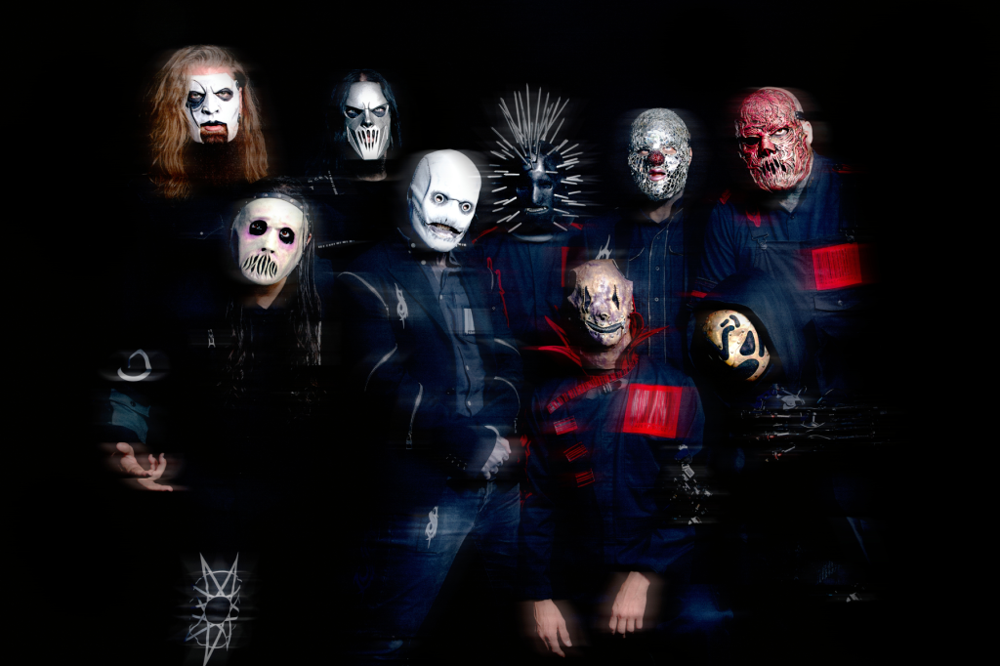

```{r setup, include=FALSE}

library(tidyverse)
options(htmltools.dir.version = FALSE)
knitr::opts_chunk$set(
  fig.width=9, fig.height=3.5, fig.retina=3,
  out.width = "36%",
  cache = FALSE,
  echo = TRUE,
  message = FALSE, 
  warning = FALSE,
  fig.show = TRUE,
  hiline = TRUE
)

hook_source <- knitr::knit_hooks$get('source')
knitr::knit_hooks$set(source = function(x, options) {
  x <- stringr::str_replace(x, "^[[:blank:]]?([^*].+?)[[:blank:]]*#<<[[:blank:]]*$", "*\\1")
  hook_source(x, options)
})
```

```{r xaringan-themer, include=FALSE, warning=FALSE}
library(xaringanthemer)
library(tidyverse)

style_solarized_dark(
  header_font_google = google_font("Open Sans "),
  header_h1_font_size = "36px",
  header_color = "black",
  text_font_google = google_font("Open Sans "),
  text_font_size = "28px",
  text_color = "black", 
  background_color = "Orange", 
  code_font_google = google_font("Share Tech Mono"),
  extra_css = list(
    ".remark-slide-content h2" = list(
      "margin-top" = "2em",
      "margin-bottom" = "2em"
    ),
    .big = list("font-size" = "150%"),
    .small = list("font-size" = "75%"),
    .subtle = list(opacity = "0.6"),
    ".countdown-has-style h3, .countdown-has-style h3 ~ p, .countdown-has-style h3 ~ ul" = list(
      "margin" = "0"
    ),
    ".countdown-has-style pre" = list(
      "margin-top" = "-10px"
    ),
    "p .remark-inline-code" = list(
      "background-color" = "orange",
      "padding" = "2px 2px",
      "margin" = "0 -2px"
    ),
    blockquote = list("margin-left" = 0),
    "em" = list(color = "#2aa198")
  ),
)

```

class: center, middle

# Welcome to PSY 505! 

---
# About Me

```{r, fig.align='center', echo=FALSE, warning=FALSE}

knitr::include_graphics("jg.jpg")
```

---
# My Journey


```{r echo=FALSE, message=FALSE, warning=FALSE, out.width="100%", out.height="60%"}

library(vistime)
library(tidyverse)
batman_data <- data.frame(

  
   event = c("M.S. DePaul University",
                  "Ph.D. Iowa State University",
                  "Post-doc -  University of Alabama-Birmingham", 
                  "Postdoc - University of Iowa",
             "RuCCS",
                  "Here at Princeton"),

  start = as.character(c("2009-08-09","2012-08-08", "2017-01-08", "2019-04-07", "2020-07-05", "2022-01-07")), 
  end = as.character(c("2012-05-06","2017-08-08", "2019-01-04", "2020-01-07", "2022-01-08", "2023-01-07"))
) 


pp <- gg_vistime(batman_data, optimize_y = FALSE)

pp <- pp + theme(axis.text.x = element_text(size = 20, color = "black", angle = 30))+ 
                   theme(text=element_text(size=12))

pp

```

---
# Research Interests

.pull-left[

- Language processing

  - Mechanisms and representations
      - Auditory and visual word recognition
      - Semantics
          - **Under ambiguity**
- Learning and memory

    - Metamemory
    - Desirable difficulties
]
--

.pull-right[
- Meta-research (philosophy of science)

  - Replication issues in psychology and neuroscience
  ]
---
# Ice Breaker

.pull-left[

<br>
<br>

- Name

- Lab

- Research interests

- Where are you from?

- What is a boring fact about you?

- One fun thing you did during the summer

]

--
.pull-right[
```{r, echo=FALSE, warning=FALSE, out.width="100%", out.height="100%"}

knitr::include_graphics("quant.jpeg")
```
]
---

```{r, echo=FALSE, warning=FALSE, out.width="100%", out.height="100%"}

knitr::include_graphics("met.png")
```
]


---
background-image: url(syllabus.jpg)
background-position: center
background-size: cover

---
# PSY 505: Precept

> Provide exposure to methods, practices, and conduct across the full range of areas and topics within psychological science. 

- Precept for PSY505

-   **Discussions.** Students will participate in discussions on various research issues. We will have several articles to discuss. These will be lead by students in the class. Please come prepared with questions and thoughts. 

-   **Guest Seminars.** Students will attend a series of lectures during the semester. Lectures may introduce a recent methodological contribution or discuss a controversial and easily overlooked issue regarding the application or interpretation of statistics. Lectures will be given by guest speakers who are expert in the topic.

-   **Tutorials.** Students will learn skills to build reproducible and transparent research programs. These tutorials may teach students how to preregister their studies, run power analyses, and organize their code with Notebooks). Tutorials may be given by guest speakers who are expert in the topic.
---
# Instructor Contact: 

- Office: PSH 325 🏢

- Email: jg9120@princeton.edu

- Cell: 515-520-3464 📱

- Twitter: jgeller_phd

---
# Office Hours:

- M 1:00 P.M.- 3:00 P.M.; W 1:00 P.M. - 2:00 P.M. 🪑

- By appointment

  - Calendly: __https://calendly.com/jg9120/30min__
  
<!-- Calendly link widget begin -->
<link href="https://assets.calendly.com/assets/external/widget.css" rel="stylesheet">
<script src="https://assets.calendly.com/assets/external/widget.js" type="text/javascript" async></script>
<a href="" onclick="Calendly.initPopupWidget({url: 'https://calendly.com/jg9120/30min'});return false;">Schedule time with me</a>
<!-- Calendly link widget end -->
---
# Course Content:

- Readings, Assignments, and Schedule: 

  - **https://psy505.netlify.app/**
  
  - **https://osf.io/qh9rb/**
  
- I will use Canvas to: 

  - Send announcements  
  
  - Retrieve assignments
  
  - Answer and send emails
  
- I will post html versions of slides day of class. PDFs will be added to the OSF page after class. 
  
---
# Assignments

## Speaker Reflections (30%)

- Reflections (500-1000 words) will be due on the Tuesday after the talk.These will be graded as ✅ 
or ⛔


---
# Assignments 

## Tutorial Assignments (30%)

On tutorial days, there will be an assignment applying what was learned during the tutorial. These will be graded as ✅ 
or ⛔

 - Assignments will be due the next class period. 
---
# Assignments

## Leading Discussion (10%)

During the semester you (possibly in a group) will be
responsible for leading discussions with that week’s assigned reading or guest. Your job will be easier if everyone jumps in and asks questions, but if the discussion is lagging, you’ll jump in with some prepared questions for the speaker.

---
# Assignments

## Write Your Own Tutorial (30%)

For your final project you will create a tutorial about how to do something in R.The final project gives you a chance to pursue any topic in the R universe and learn more about it. For example, you could choose to write a tutorial on any R package or how to perform a statistical analysis.

There is no final exam. This project is your final exam.
---
# Grades

```{r assignments-grades, message=FALSE, warning=FALSE, echo=FALSE}
assignments <- tribble(
  ~Points,  ~Assignment,
  5*6      , "Speaker Reflections",
  30, "Tutorial Assignments",
  10, "Leading Dicussion", 
  30  , "Write your own tutorial",
) %>%
  mutate(Percent = Points / sum(Points),
         Percent = scales::percent(Percent)) 

knitr::kable(assignments)

grading <- tribble(
  ~Grade, ~Range,
  "A",  "90–100%",
  "B",  "80–89%",
   "C",  "70-79%", 
  "D",  "60-69%"
)
```

---
# Class Enviroment

I would like to create a learning environment for my students that supports a diversity of thoughts, perspectives and experiences, and honors your identities (including race, gender, class, sexuality, religion, ability, SES, etc. ) To help accomplish this:

 - If you have a name and/or set of pronouns that differ from those that appear in your official Rutgers records, please let me know!
 
- If you feel like your performance in the class is being impacted by your experiences outside of class, please don't hesitate to come and talk with me. I want to be a resource for you. Remember that you can also submit anonymous feedback (which will lead to me making a general announcement to the class, if necessary to address your concerns). 

- I (like many people) am still in the process of learning about diverse perspectives and identities. If something was said in class (by anyone) that made you feel uncomfortable, please talk to me about it. (Again, anonymous feedback is always an option).

---
#Masks

Your choice. 

```{r, fig.align='center', echo=FALSE, warning=FALSE, out.width="80%"}



```
---
# Schedule
```{r out.height="100%", out.width="100%", echo=FALSE}
knitr::include_url("https://psy505.netlify.app/#schedule")

```

