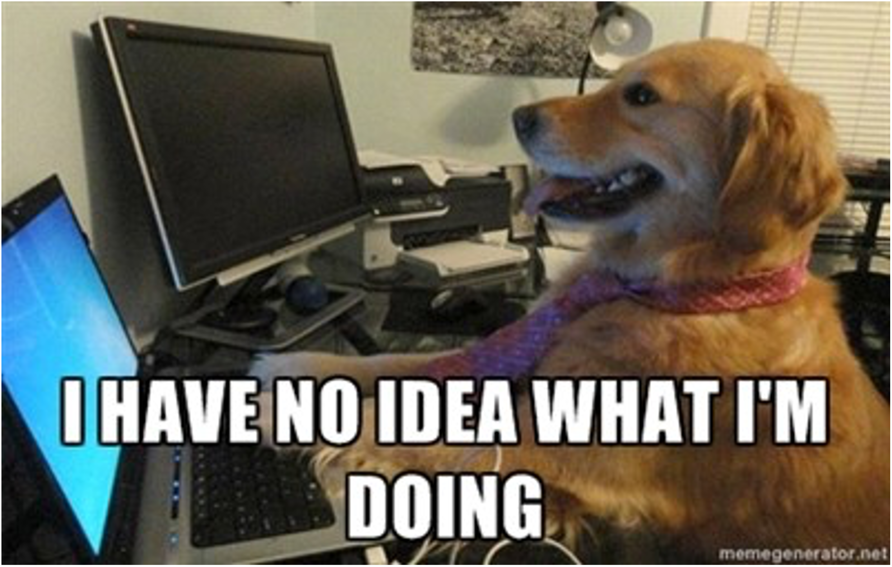
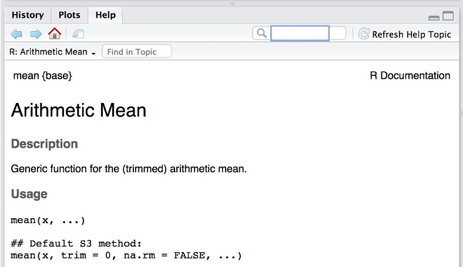
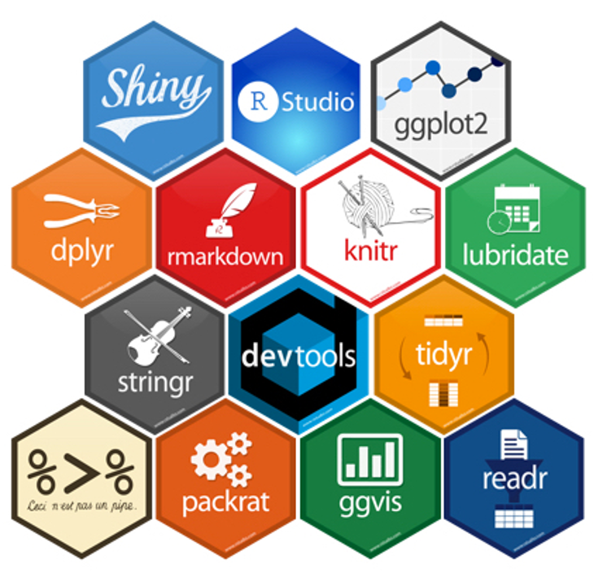
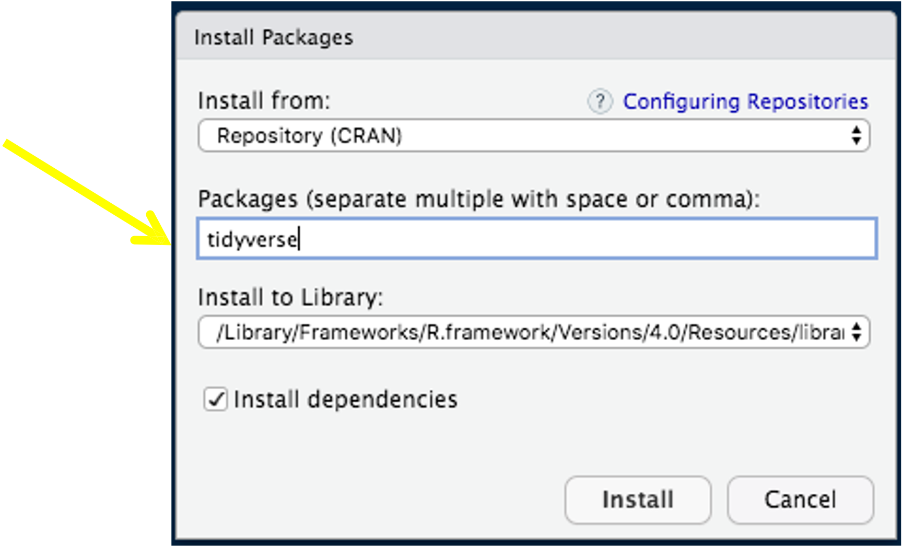

```{r setup, include=FALSE}
options(htmltools.dir.version = FALSE)
knitr::opts_chunk$set(
  fig.width=9, fig.height=3.5, fig.retina=3,
  out.width = "36%",
  cache = FALSE,
  echo = TRUE,
  message = FALSE, 
  warning = FALSE,
  fig.show = TRUE,
  hiline = TRUE
)

hook_source <- knitr::knit_hooks$get('source')
knitr::knit_hooks$set(source = function(x, options) {
  x <- stringr::str_replace(x, "^[[:blank:]]?([^*].+?)[[:blank:]]*#<<[[:blank:]]*$", "*\\1")
  hook_source(x, options)
})
```

```{r xaringan-themer, include=FALSE, warning=FALSE}
library(xaringanthemer)

style_solarized_dark(
  header_font_google = google_font("Open Sans"),
  header_h1_font_size = "36px",
  header_color = "black",
  text_font_google = google_font("Open Sans"),
  text_font_size = "28px",
  text_color = "black", 
  background_color = "orange", 
  code_font_google = google_font("Share Tech Mono"),
  extra_css = list(
    ".remark-slide-content h2" = list(
      "margin-top" = "2em",
      "margin-bottom" = "2em"
    ),
    .big = list("font-size" = "150%"),
    .small = list("font-size" = "75%"),
    .subtle = list(opacity = "0.6"),
    ".countdown-has-style h3, .countdown-has-style h3 ~ p, .countdown-has-style h3 ~ ul" = list(
      "margin" = "0"
    ),
    ".countdown-has-style pre" = list(
      "margin-top" = "-10px"
    ),
    "p .remark-inline-code" = list(
      "background-color" = "orange",
      "padding" = "2px 2px",
      "margin" = "0 -2px"
    ),
    blockquote = list("margin-left" = 0),
    "em" = list(color = "#2aa198")
  ),
)

```

# Objective

.left-column[

- Get you started with R

-  Load your first dataset in R

-  Explain some basic terminology and concepts

]

.right-column[

-  Explain how to structure any data analysis project

-  Learn how to run commands and save scripts

```{r, fig.align='center', echo=FALSE, warning=FALSE,  out.width = "50%"}

knitr::include_graphics("lover.png")
```

]

---

# It's Scary

```{r, fig.align='center', echo=FALSE, warning=FALSE,  out.width = "65%"}


```
---

# Outline

+ ` Why R `

+ IDE

+ R commands & functions

  -  Tidyverse & the Pipe Operator
  
+ Multiple Functions

+ Reading in data

+ Saving R scripts

---
Why R?

+ Free and open-source

--
+ Flexibility

--
+ Programming language (not point-and-click)

--
+ Excellent graphics (via `ggplot2`)

--
+ Easy to generate reproducible reports (markdown and quarto)

--
+ Easy to integrate with other tools and programs
--

+ Inclusive Community


???

R was created in early part of 1990s. Is free and open source. What does that mean?
Open to everyone. Anyone can contribute. I have a package called gazeR. There is a package for lots of things you make want to do. 

---

<center>

<blockquote class="twitter-tweet"><p lang="en" dir="ltr">Yes, I made the corn song about R. Let me know how the students react tomorrow <a href="https://twitter.com/minebocek?ref_src=twsrc%5Etfw">@minebocek</a>! And thanks <a href="https://twitter.com/LisaDeBruine?ref_src=twsrc%5Etfw">@LisaDeBruine</a> for the lyrics :) <a href="https://t.co/8HKHpPoiQ2">pic.twitter.com/8HKHpPoiQ2</a></p>&mdash; Rafael Moral (@rafamoral) <a href="https://twitter.com/rafamoral/status/1564376662971760642?ref_src=twsrc%5Etfw">August 29, 2022</a></blockquote> <script async src="https://platform.twitter.com/widgets.js" charset="utf-8"></script>
<center> 


---
background-image: url(console_layout.png)
background-position: center
background-size: cover

---

# Outline

+ Why R?

+ IDE

+ `R commands & functions`

  -  Tidyverse & the Pipe Operator
  
+ Multiple Functions

+ Reading in data

+ Saving R scripts

---

# Assignment of Variables

- A variable is a symbol that stands for another value (just like “X” in algebra)

```{r}

x <- 4

x

```

--
- The arrow `<-` is called an ASSIGNMENT OPERATOR, and tells R to save an object called x that has the value of 6. This is similar to saving a value in a graphing calculator.

- Can use `=` if you want 
--

```{r}

x + 7 

```


---

# Vectors

- Think of it as a row or column in a spreadsheet 

- Allows multiple types of classes to be concatenated together

    -  Numeric 

```{r}

x <-  c(2,6,16)

x

```

    - `x` here is called an object
--
 - Logical (TRUE/FALSE)
 
```{r}
x[1]==2
```

---

# Vectors

- Character
    
```{r}
x <- c("cat", "bat")

gender <- c("male", "female")
```

- Factors

- Turn character strings into specific categories

```{r}

gender <- as.factor(gender)

gender

```

- Logical vectors

```{r}

x==7

```

---
# Indexing

- Vectors can be indexed 

```{r}

x[1] # retreve first
x[2] # retreive second

x[-2] # everythin but that numbe 


```
--

- Change values in vector

```{R}

x[1] <- 7

x
```


---
# R as a Calculator

- Typing in a simple calculation show us the result

```{r}
608+ 28

```
--
```{r}
11527-283

```
--
```{r}
# divison
400/65
#multiplication
2*4
#exponentiation
5^2
```

---

# Functions

- Take an object, do something to it, and return the result

- More complex calculations can be done with functions:

  - What is square root of 64?

```{r}
# sqrt function
# in parenthesis: what we want to perform function on
sqrt(64)
```

```{r, eval=FALSE}

sr=function(a, b){
  
  a=x
  b=x
  
  c=a + b
  return(c)
}

sr(2,3)
```
---

# Arguments 

- Some functions have settings
(“arguments”) that we can adjust:

- `round(3.14)`
  - Rounds off to the nearest integer (zero  decimal places)
  
- `round(3.14, digits=1)`
  - One decimal place
  
---

# Getting Help

1. Help files

```{r, fig.align='center', echo=FALSE, warning=FALSE,  out.width = "100%"}


```
---

background-image: url(help2.png)
background-position: center
background-size: cover

---

# Exercises

1. Open a blank new script  

1.1 File -> New File > R Script

1.2 Ctrl + Shift + N 

1.3 Click on new script icon

2. In one of these scripts type "Hello World" 

3. To paste strings together you can use the `paste`() function (e.g., paste("Hello", "World")). Use ?paste or Google "paste function in R" to get an idea of how to use this function. 

3.1 Use the `paste` function to string together a sentence of your choice. Assign it to a variable or object. 

5. Modify the function above and instead of returning the sum return the product. 

---
# Outline

+ Why R

+ IDE

+ R commands & functions

  -  `Tidyverse & the Pipe Operator`
  
+ Multiple Functions

+ Reading in data

+ Saving R scripts

---

# Tidyverse and Pipes

- The `tidyverse` is an ecosystem of R packages designed for  data science. All packages share an  underlying design philosophy,  grammar, and data structures.

```{r, fig.align='center', echo=FALSE, warning=FALSE,  out.width = "40%"}


```

---


background-image: url(tidyversepacks.jpg)
background-position: center
background-size: cover
---

# Installing Tidyverse

```{r, fig.align='center', echo=FALSE, warning=FALSE,  out.width = "40%"}


```

```{r, eval=FALSE}

install.packages(tidyverse)
```

- Load package

```{r}

library(tidyverse)

```
---

# Pipes

- `tidyverse` provides another interface to functions—the pipe operator

  - Makes code easier to read and follow: 

- This: 

```{r,eval=FALSE}

a %>% 
  round()
```

--

- Can be converted into: 

  - Start with a and then round
  
-  `|>` pipe is slowly becoming more popular

---

# Outline


+ Why R

+ IDE

+ R commands & functions

  -  Tidyverse & the Pipe Operator
  
+ `Multiple Functions`

+ Reading in data

+ Saving R scripts

---
# Multiple Functions

- Pipe operator makes it easy to do multiple functions in a row

```{r, eval=FALSE}

-16 %>% 
  sqrt() %>%
  abs()
```

- What is this doing?

---

# Outline

+ Why R

+ IDE

+ R commands & functions

  -  Tidyverse & the Pipe Operator
  
+ Multiple Functions

+ `Reading in data`

+ Saving R scripts

---

# Reading in Data


- Download the file

```{r,echo=FALSE, warning=FALSE,  out.width = "100%"}

knitr::include_graphics("readr.png")
```
- General form: dataframe.name <-read.csv('filename')
---
# Data Frames

> A data frame is like an Excel spreadsheet. It is two-dimensional with rows and columns. 

  - Instead of creating a number of vectors we store all the vectors into a single DF
  
  - Can store numeric data (phone number, postal code, coordinates, etc.), float data (internet IP address, etc.), logical data (wants to receive ads: FALSE/TRUE, etc.), etc.

  
```{r}

car_model <- c("Ford Fusion", "Hyundai Accent", "Toyota Corolla")
car_price <- c(25000, 16000, 18000)
car_mileage <- c(27, 36, 32)

cars_df <- data.frame(model=car_model, price=car_price, mileage=car_mileage)

flextable::flextable(cars_df)%>% flextable::autofit()


```

---

# Tibbles

- More modern take on Data frames

  - Never changes input's type
  - Never adjusts the names of variables
  - It evaluates arguments lazily and sequentially
  
- Differences 
  - Printing
  
```{r, eval=FALSE}

as.tibble()


```
---

# Matrix

- Let's talk about the `[ , ]` 
- `[row, column]` to *subset* or grab specific values

```{r}
myMatrix <- matrix(data = 1:10,
                   nrow = 5,
                   ncol = 2)
myMatrix
```

---
# Working Directories

## `Here` package

- `Here` helps set relative as opposed to absolute paths

  - Why would this be a problem?

```{r, eval=FALSE}

#setwd("your path here")

```
  
--
```{r, out.width="50%"}
#install here
library(here)

# here

here::here()

# can use with read.csv
```

---
# Loading the Data

> Disclaimer: `Create new project folder first, open up R second`

The faculty dataset contains aggregated data per faculty:

- faculty: Business, Economics, Political Science, Sociology
- students: number of students
- profs: number of profs
- salary: amount of salary
- costs: amount of costs dataset entails demographic and school-related information on imaginary students, such as

---
 # Load the data
 
 ## CSV
 
```{r}

fac=read.csv(here::here("static", "slides", "01-R", "datasets", "faculty.csv"))

fac


```

---
# Looking at Data 

```{r}

fac%>%
  summary()

```

---
# Looking at Data
```{r}

library(skimr)

fac%>%
  skim()
```

---

# Looking at the Data

- Select specific columns

  - use $ operator to grab one column

```{r}
fac$column_name %>% 
  summary()

```


```{r, eval=FALSE}

fac%>% 
  select(column_name) %>%
  summary()

```
---

# Looking at the Data

- Whole dataset
- First 6 observations
- Last 6 observations

```{r}

fac # whole dataset

head(fac)
tail(fac)


```

---

# Looking at Data

```{r}
# look at specific variables
table(fac$students)
```
```{r}
# let's try another package
library("janitor")
tabyl(fac$students)
```

---
# Reading in Other File Types

- Excel

```{r, eval=FALSE}

library(readxl)

fac<-  read_excel('/Users/jg/Desktop/experiment.xlsx', sheet=2)
# excel files can have multiple sheets
```

- SPSS

```{r,  eval=FALSE}

library(haven)

fac<-  read_spss('/Users/jg/Desktop/experiment.spss')

```
---
# Outline

+ Why R

+ IDE

+ R commands & functions

  -  Tidyverse & the Pipe Operator
  
+ Multiple Functions

+ Reading in data

+ `Saving R scripts`
---
# Saving Files

```{r, eval=FALSE}

write.csv(fac, file="df.csv")

write.table(fac, file="df.txt")


```
---
# Wrapping Up
-  You've learned:
  - Some basic programming terminology 
  - Specific *R* defaults and issues
  - Example functions and use cases
- How do I get started? 
  - Practice!
  
---
# Helpful Websites

- Google! 
- Cheat sheets  (https://rstudio.cloud/learn/cheat-sheets)
- Quick-R: www.statmethods.net
- R documentation: www.rdocumentation.org
- Swirl: www.swirlstats.com 
- Stack Overflow: www.stackoverflow.com 
- Learn Statistics with R: https://learningstatisticswithr.com/

---

# Exercise

1. Create a variable called y with the value of 7

2. Save the results of 6 + 3 as a variable called a.

3. Create a new project folder for this course entitled "psy_505" (run the .Rproj file)

  3.1 Place the exercise.csv file in the folder
  
5. Using here assign the file to a name of your choice

7. Explore the data set by running the commands head(data), str(data), glimpse(data) and summary(data) in your R script. You will use these a lot in the future, so have a closer look at the different outputs in the console (lower left). Remember to save your script!

---
class:middle center

# Tutorial assignment due next Tuesday


